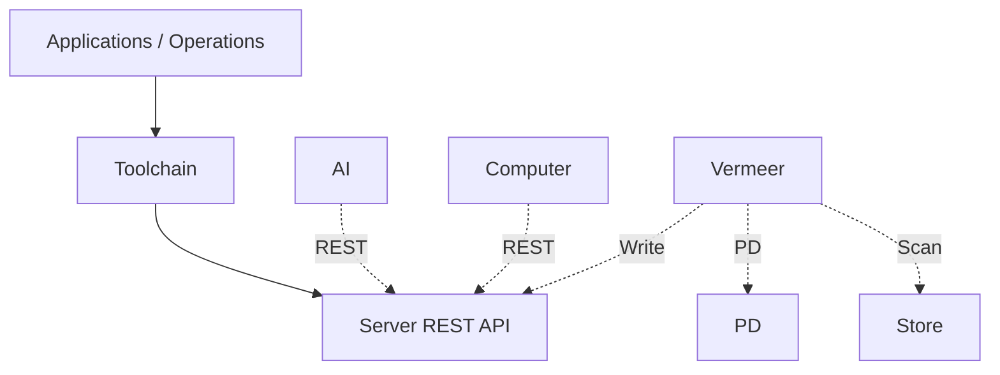
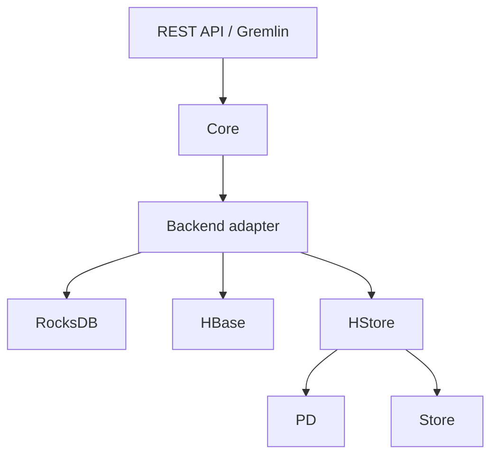

## Full-Stack Components

The HugeGraph ecosystem combines a graph database, graph computing engines, graph AI, and a toolchain with distinct responsibilities. HugeGraph Server provides OLTP graph database services; HugeGraph-Computer and Vermeer are independent OLAP engines; HugeGraph-AI provides graph AI capabilities. Toolchain clients, import tools, visualization, and operations tools provide entry points for applications and operators.

Figure: Server uses HStore as an example backend; see the Mermaid diagram below for independent backends such as RocksDB and HBase. Vermeer and HugeGraph-Computer are independent OLAP engines. Dashed arrows indicate optional integration.

## Ecosystem Integration

Optional connections do not mean every AI, Computer, or Vermeer task must connect to Server, PD, or Store. Computer and AI read and write through the Server REST API. Vermeer's HugeGraph input queries PD for partition metadata and scans HStore partitions directly through Store. With HugeGraph result output, it writes results back through the Server REST API.

## Server Internals

Server REST APIs and Gremlin send requests to Core, which reads and writes through a backend adapter. RocksDB and HBase are independent backends. The HStore adapter obtains cluster metadata and partition information from PD and sends graph operations to Store nodes. PD manages metadata and partitions; it does not carry graph data reads and writes.

Current Server implementations include RocksDB, HBase, HStore, and memory backends. Memory is for testing or temporary use, not a persistent production deployment. See the [Server quick start](/docs/quickstart/hugegraph/hugegraph-server/) for production deployment options.

Main Toolchain components:

- [Hubble](/docs/quickstart/toolchain/hugegraph-hubble/): Connects to the graph database through a web interface to manage schemas, import data, and run queries.
- [Loader](/docs/quickstart/toolchain/hugegraph-loader/): Converts multiple data sources and imports them into graph data in batches.
- [Tools](/docs/quickstart/toolchain/hugegraph-tools/): Provides command-line deployment, management, backup, and restore operations.
- [Client](/docs/quickstart/client/hugegraph-client/): Wraps Server connections, schema management, graph reads and writes, and queries. Clients are available for [Java](/docs/quickstart/client/hugegraph-client/), [Python](/docs/quickstart/client/hugegraph-client-python/), and [Go](/docs/quickstart/client/hugegraph-client-go/); a Rust client is under development.

## Independent Graph Computing Engines

- [Vermeer](/docs/quickstart/computing/hugegraph-vermeer/): Provides independent graph computing services and algorithm APIs.
- [HugeGraph-Computer](/docs/quickstart/computing/hugegraph-computer/): A Java distributed graph computing engine based on BSP/Pregel.

## Historical Architecture

The following diagram is retained for historical reference. Its depiction of Server providing both OLTP and OLAP, and of various old backends, does not describe current master.

> [!DETAILS]- Expand the historical architecture diagram
>
> 
