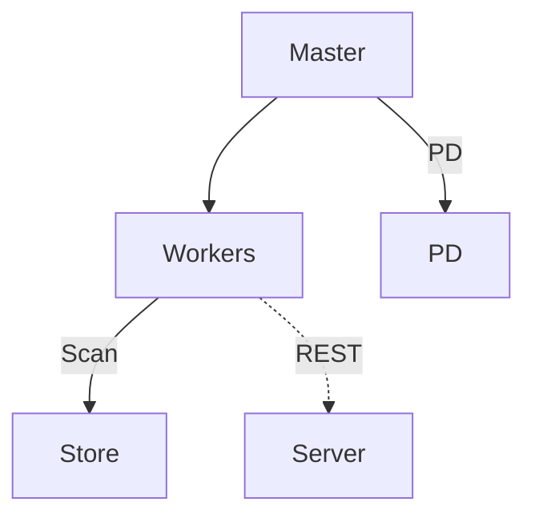
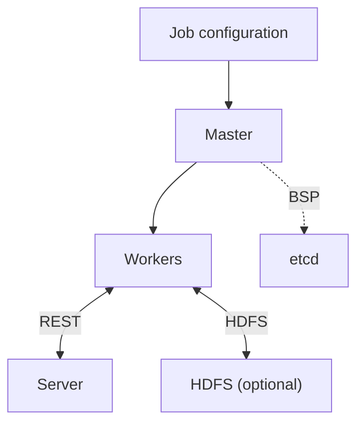

The HugeGraph-Computer repository contains two graph computing systems with different deployment and runtime models. Start with Go Vermeer for general graph algorithms; use Computer when you need distributed Java BSP/Pregel computation. Both can connect to HugeGraph, but their configuration and job entry points are not interchangeable.

### Default entry: Go Vermeer

With `load.type=hugegraph`, the Vermeer master queries PD for partition metadata and workers scan HStore Store partitions directly. Workers write results through the Server REST API only when `output.type=hugegraph`; other input sources or output settings do not require those connections.

### Java Computer

Job configuration can be submitted through the Kubernetes Operator or YARN. Workers read graph data through the HugeGraph Server REST API and can write results back according to the output configuration. With HDFS input or output, workers access HDFS directly. The master uses etcd to coordinate BSP jobs.

- [Vermeer Quick Start](./hugegraph-vermeer.md)
- [Computer Quick Start](./hugegraph-computer/)
- [Computer Configuration Reference](./hugegraph-computer-config.md)
- [Computer source code](https://github.com/apache/hugegraph-computer)
