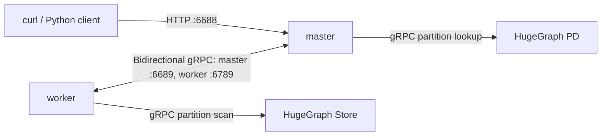

## 1. Overview of Vermeer

### 1.1 Architecture

Vermeer is a high-performance, memory-first graph computing framework written in Go: start once and execute repeatedly. It supports fast execution of 15+ OLAP algorithms, often in seconds to minutes; actual time depends on graph size, algorithm parameters, and resources. A single master currently schedules multiple workers.

The master handles communication, forwarding, and aggregation, with modest computation and resource usage. Workers store graph data and execute tasks, consuming most memory and CPU. gRPC handles internal communication; REST provides external APIs.

At startup, built-in defaults are loaded first, followed by the `[default]` section of `config/<env>.ini` under the working directory, then explicit command-line overrides. For example, `--env=master` reads `config/master.ini`. The Docker image copies repository configuration to `/go/bin/config/` and works from `/go/bin/`. A host bind mount hides the bundled files, so it must contain every ini file used. The configuration reader does not read environment variables.

Default ports:

| Role | Configuration key | Default address | Purpose |
|---|---|---|---|
| master | `http_peer` | `0.0.0.0:6688` | REST API for host-side clients |
| master | `grpc_peer` | `0.0.0.0:6689` | Workers connect to master |
| worker | `http_peer` | `0.0.0.0:6788` | Worker HTTP service |
| worker | `grpc_peer` | `0.0.0.0:6789` | Worker gRPC listener, also advertised to master for node communication |

The Docker examples publish only master HTTP on host loopback `127.0.0.1:6688:6688`; master and worker gRPC ports stay within the container network.



### 1.2 Running Vermeer

> [!WARNING]
> In production, enable [Server authentication and authorization](/docs/config/config-authentication/), an IP allowlist, and minimum permissions; retain `audit-*.log`. Server Auth does not protect independent Vermeer, PD, or Store APIs. Restrict these HTTP/gRPC ports to trusted networks and callers, and configure access controls at the Vermeer external entry point.
>
> `master.ini` defaults to `auth=none`, disabling authentication for ordinary and administrative APIs. Local examples publish loopback only. Before remote access, enable `auth=token` or restrict callers through a protected network or gateway.

Both Docker options need a host configuration directory. From the Vermeer repository root, copy the supplied [`master.ini`](https://github.com/apache/hugegraph-computer/blob/master/vermeer/config/master.ini) and [`worker.ini`](https://github.com/apache/hugegraph-computer/blob/master/vermeer/config/worker.ini) templates. The mount hides image configuration under `/go/bin/config`, so never mount an empty directory or your entire home directory there:

```shell
CONFIG_DIR="$HOME/vermeer-config"
mkdir -p "$CONFIG_DIR"
cp config/master.ini config/worker.ini "$CONFIG_DIR/"
```

Keep master HTTP/gRPC listeners at `0.0.0.0:6688` and `0.0.0.0:6689`. The Compose example assigns `172.20.0.10` to master and `172.20.0.11` to worker; set these options in the copied `worker.ini`:

```ini
[default]
http_peer=0.0.0.0:6788
grpc_peer=172.20.0.11:6789
master_peer=172.20.0.10:6689
run_mode=worker
worker_group=$
```

This single-worker example uses literal `worker_group=$`, the general group used when no named group is bound. The repository template defaults to `worker_group=default`; if retaining that named group, bind it to the task space or graph before submitting tasks. For default space `$DEFAULT`, use:

```shell
curl --fail --show-error -X POST \
  'http://localhost:6688/admin/workers/alloc/default/%24DEFAULT'
```

An `errcode=0` response confirms binding; with token authentication, also supply the authorization header. `master_peer` must reach master gRPC from the worker network. `grpc_peer` is both the listener and advertised worker address, so do not advertise `0.0.0.0`, which other containers cannot reach. Update these IPs when changing the subnet or addresses; each additional worker needs a unique, mutually reachable `grpc_peer`.

1. **Option 1: Docker Compose (Recommended)**

Run from the Vermeer repository root. Modify existing `docker-compose.yaml` or use the following example. The repository file currently mounts all of `~/` as configuration and does not publish master HTTP; replace the mount and add the port mapping before starting:

```yaml
services:
  vermeer-master:
    image: hugegraph/vermeer
    container_name: vermeer-master
    ports:
      - "127.0.0.1:6688:6688"
    volumes:
      - /home/user/vermeer-config:/go/bin/config:ro
    command: --env=master
    networks:
      vermeer_network:
        ipv4_address: 172.20.0.10 # Static master address

  vermeer-worker:
    image: hugegraph/vermeer
    container_name: vermeer-worker
    volumes:
      - /home/user/vermeer-config:/go/bin/config:ro
    command: --env=worker
    networks:
      vermeer_network:
        ipv4_address: 172.20.0.11 # Static worker address

networks:
  vermeer_network:
    driver: bridge
    ipam:
      config:
        - subnet: 172.20.0.0/24 # Change the subnet as needed
```

Replace `/home/user/vermeer-config` with your actual absolute configuration directory. Changing the subnet or static IPs of `vermeer_network` also requires updating `grpc_peer` and `master_peer` in `worker.ini`. Do not use the default `grpc_peer=0.0.0.0:6789` as an advertised container address.

Build and start from the project directory:

```shell
# Build the image from the Vermeer root directory
docker build -t hugegraph/vermeer .

# Start from the Vermeer root directory
docker-compose up -d
# Or use the newer CLI:
# docker compose up -d
```

View logs / stop / remove:

```shell
docker-compose logs -f
docker-compose down
```

2. **Option 2: Separate docker run Commands (Manual Network and Static IPs)**

Set `CONFIG_DIR` to the prepared configuration directory, with `grpc_peer` and `master_peer` matching the static container addresses. Replace the example `CONFIG_DIR` with your actual absolute path.

Build the image:

```shell
docker build -t hugegraph/vermeer .
```

Create a custom bridge network (once):

```shell
docker network create --driver bridge \
  --subnet 172.20.0.0/24 \
  vermeer_network
```

Run master (use your absolute `CONFIG_DIR` and adjust IPs as needed):

```shell
CONFIG_DIR=/home/user/vermeer-config

docker run -d \
  --name vermeer-master \
  --network vermeer_network --ip 172.20.0.10 \
  -p 127.0.0.1:6688:6688 \
  -v ${CONFIG_DIR}:/go/bin/config:ro \
  hugegraph/vermeer \
  --env=master
```

Run worker:

```shell
docker run -d \
  --name vermeer-worker \
  --network vermeer_network --ip 172.20.0.11 \
  -v ${CONFIG_DIR}:/go/bin/config:ro \
  hugegraph/vermeer \
  --env=worker
```

View logs / stop / remove:

```shell
docker logs -f vermeer-master
docker logs -f vermeer-worker

docker stop vermeer-master vermeer-worker
docker rm vermeer-master vermeer-worker

# Delete the custom network if needed
docker network rm vermeer_network
```

3. **Option 3: Build from Source**

Build following the [Vermeer README](https://github.com/apache/hugegraph-computer/tree/master/vermeer).

```shell
go build
```

Start from the Vermeer root directory with `./vermeer --env=master` and `./vermeer --env=worker01`. In `worker01.ini`, set `grpc_peer` to an address bindable locally and reachable by master and other workers; point `master_peer` to master gRPC.

After starting master, check its HTTP port from the host:

```shell
curl --fail --show-error http://localhost:6688/graphs
```

Expect HTTP 200 and JSON `errcode=0`.

## 2. Task Creation REST API

### 2.1 Introduction

Submit a `load` task, wait for loading to finish, then submit a `compute` task. A loaded graph can support repeated computations and is not deleted after completion. Asynchronous APIs return creation results and task information, including ID, before completion; synchronous APIs wait for success or failure, so client and proxy HTTP timeouts must be sufficiently long. Query task states: `loaded` for successful loading, `complete` for successful computation, `error` for failure, and `canceled` for cancellation; other states remain waiting or running. Graphs loading or in an error state cannot be computed. Deletion requires a deletable graph state and no current usage.

Available URLs:

- Asynchronous: `POST http://master_ip:port/tasks/create`; read the ID from response `task.id`.
- Synchronous: `POST http://master_ip:port/tasks/create/sync`; returns after the task ends.
- Query task: `GET http://master_ip:port/task/{task_id}`. `errcode=0` indicates a successful query; inspect `task.state` for task status. Set a client polling deadline for asynchronous jobs; reaching it stops client waiting without canceling the server task.

### 2.2 Loading Graph Data

The examples list common load parameters. Each loader reads its own keys; unused keys do not change behavior.

Vermeer provides three loading methods:

1. Local files

`load.vertex_files` and `load.edge_files` map worker address host portions to file paths read by those workers. With containers, mount data into the worker and use container paths. In the Compose example, mount a host data directory at worker `/data` (such as `- /host/data:/data:ro`) and use `172.20.0.11` from `grpc_peer` as the mapping key. Other deployments use the host portion of their advertised worker addresses.

Obtain a dataset such as [Twitter-2010](https://snap.stanford.edu/data/twitter-2010.html); the first `twitter-2010.txt.gz` file is sufficient.

**Request example:**

```javascript
POST http://localhost:6688/tasks/create
{
 "task_type": "load",
 "graph": "testdb",
 "params": {
  "load.parallel": "50",
  "load.type": "local",
  "load.vertex_files": "{\"172.20.0.11\":\"/data/twitter-2010.v_[0,99]\"}",
  "load.edge_files": "{\"172.20.0.11\":\"/data/twitter-2010.e_[0,99]\"}",
  "load.use_out_degree": "1",
  "load.use_outedge": "1"
 }
}
```

2. HugeGraph

**Request example:**

Replace request addresses, graph name, and credentials with your actual connection settings.

```javascript
POST http://localhost:6688/tasks/create
{
  "task_type": "load",
  "graph": "testdb",
  "params": {
    "load.parallel": "50",
    "load.type": "hugegraph",
    "load.hg_pd_peers": "[\"<pd-address-reachable-from-vermeer>:8686\"]",
    "load.hugegraph_name": "DEFAULT/hugegraph2/g",
    "load.hugegraph_username": "admin",
    "load.hugegraph_password": "<your-password-here>",
    "load.use_out_degree": "1",
    "load.use_outedge": "1"
  }
}
```

Vermeer master connects to PD through `load.hg_pd_peers` to look up partitions; workers read data from the returned Store addresses. These services must be reachable from the corresponding Vermeer hosts or containers. Inside Docker, `127.0.0.1` identifies the container itself, not the host or another container.

3. HDFS

**Request example:**

```javascript
POST http://localhost:6688/tasks/create
{
  "task_type": "load",
  "graph": "testdb",
  "params": {
    "load.parallel": "50",
    "load.type": "hdfs",
    "load.hdfs_namenode": "name_node1:9000",
    "load.hdfs_conf_path": "/path/to/conf",
    "load.krb_realm": "EXAMPLE.COM",
    "load.krb_name": "user@EXAMPLE.COM",
    "load.krb_keytab_path": "/path/to/keytab",
    "load.krb_conf_path": "/path/to/krb5.conf",
    "load.hdfs_use_krb": "1",
    "load.vertex_files": "/data/graph/vertices",
    "load.edge_files": "/data/graph/edges",
    "load.use_out_degree": "1",
    "load.use_outedge": "1"
  }
}
```

### 2.3 Outputting Computation Results

Current result writers support `local`, `hdfs`, and `hugegraph` through `output.type`; `none` disables output. Source retains an `afs` constant, but current master registers no AFS loader or writer. Set `output.need_statistics=1` to put statistics into task information; supported statistics operators depend on each algorithm implementation.

The examples list common computation and output parameters; supported algorithm parameters depend on current Vermeer implementations.

Request example:

```javascript
POST http://localhost:6688/tasks/create
{
 "task_type": "compute",
 "graph": "testdb",
 "params": {
 "compute.algorithm": "pagerank",
 "compute.parallel": "10",
 "compute.max_step": "10",
 "output.type": "local",
 "output.parallel": "1",
 "output.file_path": "result/pagerank"
  }
}
```

`output.type=local` writes to the executing worker's local filesystem. For containers, mount the output directory if the host needs to read results.


## 3. Supported Algorithms

### 3.1 PageRank

The PageRank algorithm, also known as the web ranking algorithm, is a technique used by search engines to calculate the relevance and importance of web pages (nodes) based on their mutual hyperlinks.

- If a web page is linked to by many other web pages, it indicates that the web page is relatively important, and its PageRank value will be relatively high.
- If a web page with a high PageRank value links to other web pages, the PageRank value of the linked web pages will also increase accordingly.

The PageRank algorithm is suitable for scenarios such as web page ranking and identifying key figures in social networks.

Request example:

```javascript
POST http://localhost:6688/tasks/create
{
 "task_type": "compute",
 "graph": "testdb",
 "params": {
 "compute.algorithm": "pagerank",
 "compute.parallel":"10",
 "output.type":"local",
 "output.parallel":"1",
 "output.file_path":"result/pagerank",
 "compute.max_step":"10"
 }
}
```

### 3.2 WCC (Weakly Connected Components)

The weakly connected components algorithm calculates all connected subgraphs in an undirected graph and outputs the weakly connected subgraph ID to which each vertex belongs, indicating the connectivity between points and distinguishing different connected communities.

Request example:

```javascript
POST http://localhost:6688/tasks/create
{
 "task_type": "compute",
 "graph": "testdb",
 "params": {
 "compute.algorithm": "wcc",
 "compute.parallel":"10",
 "output.type":"local",
 "output.parallel":"1",
 "output.file_path":"result/wcc",
 "compute.max_step":"10"
 }
}
```

### 3.3 LPA (Label Propagation Algorithm)

The label propagation algorithm is a graph clustering algorithm commonly used in social networks to discover potential communities.

Request example:

```javascript
POST http://localhost:6688/tasks/create
{
 "task_type": "compute",
 "graph": "testdb",
 "params": {
 "compute.algorithm": "lpa",
 "compute.parallel":"10",
 "output.type":"local",
 "output.parallel":"1",
 "output.file_path":"result/lpa",
 "compute.max_step":"10"
 }
}
```

### 3.4 Degree Centrality

The degree centrality algorithm calculates the degree centrality value of each node in the graph, supporting both undirected and directed graphs. Degree centrality is an important indicator of node importance; the more edges a node has with other nodes, the higher its degree centrality value, and the more important the node is in the graph. In an undirected graph, degree centrality is calculated based on edge information to count the number of times a node appears, resulting in the degree centrality value of the node. In a directed graph, it is based on the direction of the edges, filtering based on input or output-edge information to count the number of times a node appears, resulting in the in-degree or out-degree value of the node. It indicates the importance of each point, with more important points having higher degrees.

Request example:

```javascript
POST http://localhost:6688/tasks/create
{
 "task_type": "compute",
 "graph": "testdb",
 "params": {
 "compute.algorithm": "degree",
 "compute.parallel":"10",
 "output.type":"local",
 "output.parallel":"1",
 "output.file_path":"result/degree",
 "degree.direction":"both"
 }
}
```

### 3.5 Closeness Centrality

Closeness centrality is used to calculate the inverse of the shortest distance from a node to all other reachable nodes, accumulating and normalizing the value. Closeness centrality can be used to measure the time it takes for information to be transmitted from the node to other nodes. The larger the closeness centrality of a node, the closer its position in the graph is to the center, suitable for scenarios such as identifying key nodes in social networks.

Request example:

```javascript
POST http://localhost:6688/tasks/create
{
 "task_type": "compute",
 "graph": "testdb",
 "params": {
 "compute.algorithm": "closeness_centrality",
 "compute.parallel":"10",
 "output.type":"local",
 "output.parallel":"1",
 "output.file_path":"result/closeness_centrality",
 "closeness_centrality.sample_rate":"0.01"
 }
}
```

### 3.6 Betweenness Centrality

The betweenness centrality algorithm determines the value of a node as a "bridge" node; the larger the value, the more likely it is to be a necessary path between two points in the graph. Typical examples include mutual followers in social networks. It is suitable for measuring the degree of aggregation around a node in a community.

Request example:

```javascript
POST http://localhost:6688/tasks/create
{
 "task_type": "compute",
 "graph": "testdb",
 "params": {
 "compute.algorithm": "betweenness_centrality",
 "compute.parallel":"10",
 "output.type":"local",
 "output.parallel":"1",
 "output.file_path":"result/betweenness_centrality",
 "betweenness_centrality.sample_rate":"0.01"
 }
}
```

### 3.7 Triangle Count

The triangle count algorithm calculates the number of triangles passing through each vertex, suitable for calculating the relationships between users and whether the associations form triangles. The more triangles, the higher the degree of association between nodes in the graph, and the tighter the organizational relationship. In social networks, triangles indicate cohesive communities, and identifying triangles helps understand clustering and interconnections among individuals or groups in the network. In financial or transaction networks, the presence of triangles may indicate suspicious or fraudulent activities, and triangle counting can help identify transaction patterns that may require further investigation.

The output result is the Triangle Count corresponding to each vertex, i.e., the number of triangles the vertex is part of.

Note: This algorithm is for undirected graphs and ignores edge directions.

Request example:

```javascript
POST http://localhost:6688/tasks/create
{
 "task_type": "compute",
 "graph": "testdb",
 "params": {
 "compute.algorithm": "triangle_count",
 "compute.parallel":"10",
 "output.type":"local",
 "output.parallel":"1",
 "output.file_path":"result/triangle_count"
 }
}
```

### 3.8 K-Core

The K-Core algorithm marks all vertices with a degree of K, suitable for graph pruning and finding the core part of the graph.

Request example:

```javascript
POST http://localhost:6688/tasks/create
{
 "task_type": "compute",
 "graph": "testdb",
 "params": {
 "compute.algorithm": "kcore",
 "compute.parallel":"10",
 "output.type":"local",
 "output.parallel":"1",
 "output.file_path":"result/kcore",
 "kcore.degree_k":"5"
 }
}
```

### 3.9 SSSP (Single Source Shortest Path)

The single source the shortest path algorithm calculates the shortest distance from one point to all other points.

Request example:

```javascript
POST http://localhost:6688/tasks/create
{
 "task_type": "compute",
 "graph": "testdb",
 "params": {
 "compute.algorithm": "sssp",
 "compute.parallel":"10",
 "output.type":"local",
 "output.parallel":"1",
 "output.file_path":"result/degree",
 "sssp.source":"tom"
 }
}
```

### 3.10 KOUT

Starting from a point, get the k-layer nodes of this point.

Request example:

```javascript
POST http://localhost:6688/tasks/create
{
 "task_type": "compute",
 "graph": "testdb",
 "params": {
 "compute.algorithm": "kout",
 "compute.parallel":"10",
 "output.type":"local",
 "output.parallel":"1",
 "output.file_path":"result/kout",
 "kout.source":"tom",
 "compute.max_step":"6"
 }
}
```

### 3.11 Louvain

The Louvain algorithm is a community detection algorithm based on modularity. The basic idea is that nodes in the network try to traverse all neighbor community labels and choose the community label that maximizes the modularity increment. After maximizing modularity, each community is regarded as a new node, and the process is repeated until the modularity no longer increases.

The distributed Louvain algorithm implemented on Vermeer is affected by factors such as node order and parallel computation. Due to the random traversal order of the Louvain algorithm, community compression also has a certain randomness, leading to different results in multiple executions. However, the overall trend will not change significantly.

Request example:

```javascript
POST http://localhost:6688/tasks/create
{
 "task_type": "compute",
 "graph": "testdb",
 "params": {
 "compute.algorithm": "louvain",
 "compute.parallel":"10",
 "compute.max_step":"1000",
 "louvain.threshold":"0.0000001",
 "louvain.resolution":"1.0",
 "louvain.step":"10",
 "output.type":"local",
 "output.parallel":"1",
 "output.file_path":"result/louvain"
  }
 }
```

### 3.12 Jaccard Similarity Coefficient

The Jaccard index, also known as the Jaccard similarity coefficient, is used to compare the similarity and diversity between finite sample sets. The larger the Jaccard coefficient value, the higher the similarity of the samples. It is used to calculate the Jaccard similarity coefficient between a given source point and all other points in the graph.

Request example:

```javascript
POST http://localhost:6688/tasks/create
{
 "task_type": "compute",
 "graph": "testdb",
 "params": {
 "compute.algorithm": "jaccard",
 "compute.parallel":"10",
 "compute.max_step":"2",
 "jaccard.source":"123",
 "output.type":"local",
 "output.parallel":"1",
 "output.file_path":"result/jaccard"
 }
}
```

### 3.13 Personalized PageRank

The goal of personalized PageRank is to calculate the relevance of all nodes relative to user u. Starting from the node corresponding to user u, at each node, there is a probability of 1-d to stop walking and start again from u, or a probability of d to continue walking, randomly selecting a node from the nodes pointed to by the current node to walk down. It is used to calculate the personalized PageRank score starting from a given starting point, suitable for scenarios such as social recommendations.

Since the calculation requires using out-degree, load.use_out_degree needs to be set to 1 when reading the graph.

Request example:

```javascript
POST http://localhost:6688/tasks/create
{
 "task_type": "compute",
 "graph": "testdb",
 "params": {
 "compute.algorithm": "ppr",
 "compute.parallel":"100",
 "compute.max_step":"10",
 "ppr.source":"123",
 "ppr.damping":"0.85",
 "ppr.diff_threshold":"0.00001",
 "output.type":"local",
 "output.parallel":"1",
 "output.file_path":"result/ppr"
 }
}
```

### 3.14 Global Kout

Calculate the k-degree neighbors of all nodes in the graph (excluding themselves and 1~k-1 degree neighbors). Due to the severe memory expansion of the global kout algorithm, k is currently limited to 1 and 2. Additionally, the global kout algorithm supports filtering functions (parameters such as "compute.filter":"risk_level==1"), and the filtering condition is judged when calculating the k-degree. The final result set includes those that meet the filtering condition. The algorithm's final output is the number of neighbors that meet the condition.

Request example:

```javascript
POST http://localhost:6688/tasks/create
{
 "task_type": "compute",
 "graph": "testdb",
 "params": {
 "compute.algorithm": "kout_all",
 "compute.parallel":"10",
 "output.type":"local",
 "output.parallel":"10",
 "output.file_path":"result/kout",
 "compute.max_step":"2",
 "compute.filter":"risk_level==1"
 }
}
```

### 3.15 Clustering Coefficient

The clustering coefficient represents the coefficient of the clustering degree of nodes in a graph. In real networks, especially in specific networks, nodes tend to establish a tightly organized relationship due to relatively high-density connection points. The clustering coefficient algorithm (Cluster Coefficient) is used to calculate the clustering degree of nodes in the graph. This algorithm is for local clustering coefficients. The local clustering coefficient can measure the clustering degree around each node in the graph.

Request example:

```javascript
POST http://localhost:6688/tasks/create
{
 "task_type": "compute",
 "graph": "testdb",
 "params": {
 "compute.algorithm": "clustering_coefficient",
 "compute.parallel":"100",
 "compute.max_step":"10",
 "output.type":"local",
 "output.parallel":"1",
 "output.file_path":"result/cc"
 }
}
```

### 3.16 SCC (Strongly Connected Components)

In the mathematical theory of directed graphs, if every vertex of a graph can be reached from any other point in the graph, the graph is said to be strongly connected. The parts of any directed graph that can achieve strong connectivity are called strongly connected components. It indicates the connectivity between points and distinguishes different connected communities.

Request example:

```javascript
POST http://localhost:6688/tasks/create
{
 "task_type": "compute",
 "graph": "testdb",
 "params": {
 "compute.algorithm": "scc",
 "compute.parallel":"10",
 "output.type":"local",
 "output.parallel":"1",
 "output.file_path":"result/scc",
 "compute.max_step":"200"
 }
}

```

> 🚧, further updates and improvements will be made at any time. Suggestions and feedback are welcome.
