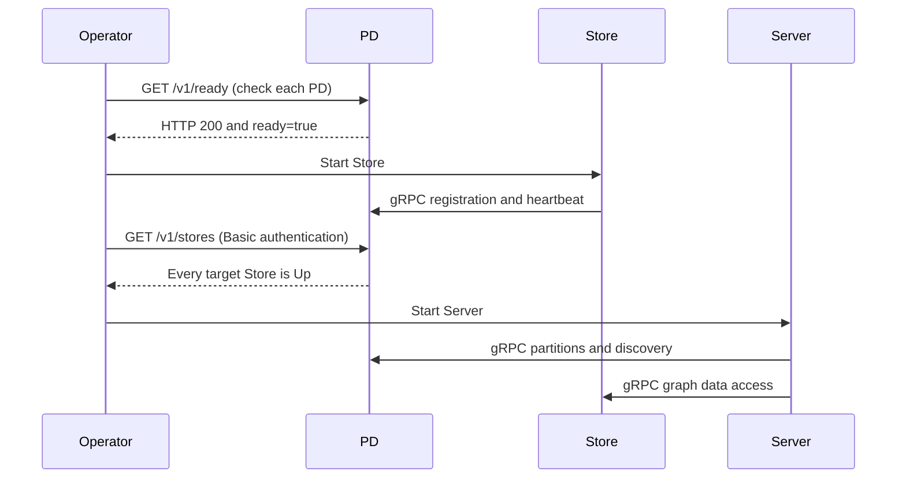

### 1 HugeGraph-PD Overview

HugeGraph-PD (Placement Driver) is the metadata management component of HugeGraph's distributed version, responsible for managing the distribution of graph data and coordinating storage nodes. It plays a central role in distributed HugeGraph, maintaining cluster status and coordinating HugeGraph-Store storage nodes.

PD keeps cluster metadata in an embedded RocksDB store under `pd.data-path` and replicates it across PD nodes with Raft, so a 3-node or 5-node PD cluster keeps serving while a minority of nodes is down. On top of that it registers and activates Store nodes, allocates and rebalances partitions, tracks Store heartbeats, and answers service discovery queries from Store and Server.

PD listens on three ports:

| Port | Default | Configured by | Used by |
|------|---------|---------------|---------|
| gRPC | `8686` | `grpc.port` | Store and Server clients |
| REST | `8620` | `server.port` | Management, health checks, metrics |
| Raft | `8610` | `raft.address` | The other PD nodes only |

### 2 Prerequisites

#### 2.1 Requirements

- Operating System: Linux or macOS (Windows has not been fully tested)
- Java version: ≥ 11
- Maven version: ≥ 3.5.0

### 3 Deployment

There are two ways to deploy the HugeGraph-PD component:

- Method 1: Download the tar package
- Method 2: Compile from source

#### 3.1 Download the tar package

Apache downloads currently provide the complete 1.7.0 binary bundle containing PD, Store, and Server, without a separate PD binary. Verify version, signatures, and SHA512 on the [official download page](https://hugegraph.apache.org/docs/download/download/). This historical incubating release retains `incubating` in archive and extracted directory names:

```bash
# Historical release 1.7.0 retains incubating in filenames and directories
wget https://downloads.apache.org/hugegraph/1.7.0/apache-hugegraph-incubating-1.7.0.tar.gz
tar zxf apache-hugegraph-incubating-1.7.0.tar.gz
cd apache-hugegraph-incubating-1.7.0/apache-hugegraph-pd-incubating-1.7.0
```

#### 3.2 Compile from source

```bash
# 1. Clone the source code
git clone https://github.com/apache/hugegraph.git

# 2. Build the project
cd hugegraph
mvn clean install -DskipTests=true

# 3. After a successful build, the PD directory and packages are located at
#    hugegraph-pd/apache-hugegraph-pd-{version}          (unpacked PD distribution)
#    hugegraph-pd/apache-hugegraph-pd-{version}.tar.gz   (PD only package, Linux build hosts only)
#    target/apache-hugegraph-{version}.tar.gz            (PD + Store + Server package)
```

To build only the PD distribution and the modules it depends on:

```bash
mvn clean package -pl hugegraph-pd/hg-pd-dist -am -DskipTests
```

The unpacked distribution contains just three directories: `bin` (start and stop scripts), `conf` (`application.yml`, `application.yml.template`, `log4j2.xml`, `verify-license.json`) and `lib` (the `hg-pd-service` jar).

#### 3.3 Docker Deployment

`HG_PD_*` mappings and `/v1/ready` are features of current master; the Server `1.7.0` source tag lacks these Docker mappings and readiness API. The following examples require images built from current master and tagged `local`. For release 1.7.0 assets, use bundled configuration and version-specific instructions:

```bash
# Run from the HugeGraph repository root
docker build -f hugegraph-pd/Dockerfile -t hugegraph/pd:local .
```

To run master-built PD alone, first set a deployment-specific secret and replace example addresses with addresses reachable by the container:

```bash
export HG_PD_AUTH_SECRET_KEY="$(openssl rand -hex 24)"
docker run -d \
  -p 8620:8620 -p 8686:8686 -p 8610:8610 \
  -e HG_PD_GRPC_HOST=192.168.1.10 \
  -e HG_PD_RAFT_ADDRESS=192.168.1.10:8610 \
  -e HG_PD_RAFT_PEERS_LIST=192.168.1.10:8610 \
  -e HG_PD_INITIAL_STORE_LIST=192.168.1.20:8500 \
  -e HG_PD_AUTH_SECRET_KEY="$HG_PD_AUTH_SECRET_KEY" \
  -v /path/to/data:/hugegraph-pd/pd_data \
  --name hugegraph-pd \
  hugegraph/pd:local
```

| Variable | Required | Default | Configuration key | Description |
|------|------|--------|------------|------|
| `HG_PD_GRPC_HOST` | Yes | None | `grpc.host` | Advertised gRPC hostname/IP; use container hostnames within a container network. |
| `HG_PD_RAFT_ADDRESS` | Yes | None | `raft.address` | This PD node's Raft address. |
| `HG_PD_RAFT_PEERS_LIST` | Yes | None | `raft.peers-list` | Raft addresses of every PD node, including this node. |
| `HG_PD_INITIAL_STORE_LIST` | Yes | None | `pd.initial-store-list` | Expected Store gRPC addresses. |
| `HG_PD_AUTH_SECRET_KEY` | Yes | None | `auth.secret-key` | REST Basic password shared by all PD REST clients. |
| `HG_PD_GRPC_PORT` | No | `8686` | `grpc.port` | gRPC service port. |
| `HG_PD_REST_PORT` | No | `8620` | `server.port` | REST API port. |
| `HG_PD_DATA_PATH` | No | `/hugegraph-pd/pd_data` | `pd.data-path` | Metadata path. |
| `HG_PD_INITIAL_STORE_COUNT` | No | `1` | `pd.initial-store-count` | Minimum Store count needed for cluster availability. |
| `HG_PD_ACTUATOR_EXPOSURE` | No | `health,metrics,prometheus` | `management.endpoints.web.exposure.include` | Public Actuator endpoint allowlist; `*` is forbidden. |

The master entrypoint requires all five mandatory variables, builds `SPRING_APPLICATION_JSON` overrides, then starts PD. Other settings come from image `conf/application.yml`; `JAVA_OPTS` is passed to the JVM. Deprecated `GRPC_HOST`, `RAFT_ADDRESS`, `RAFT_PEERS`, and `PD_INITIAL_STORE_LIST` remain supported with warnings.

Docker `HEALTHCHECK` polls `/v1/health` every 15 seconds, confirming only REST listener liveness, not a Raft quorum. Compose uses the same liveness check; verify `/v1/ready` separately before starting Store. Containers run Java in the foreground and exit when Java exits; automatic restart requires a Docker restart policy. Inspect logs with `docker logs <container-name>`.

See the [Store Docker section](./hugegraph-hstore.md#33-docker-deployment) and [docker/README.md](https://github.com/apache/hugegraph/blob/master/docker/README.md) for master Compose and the minimal topology. When starting the full topology with Hubble, first generate the untracked Hubble configuration described in that README.


### 4 Configuration

PD startup reads installation `conf/application.yml`. Match this file to the installed version: [1.7.0 configuration](https://github.com/apache/hugegraph/blob/1.7.0/hugegraph-pd/hg-pd-dist/src/assembly/static/conf/application.yml) or [master configuration](https://github.com/apache/hugegraph/blob/master/hugegraph-pd/hg-pd-dist/src/assembly/static/conf/application.yml). Master leaves `auth.secret-key` empty, causing protected REST calls to be rejected until configured. Startup does not read `application.yml.template`.

#### 4.1 Configuration Reference

These tables were checked against `hg-pd-dist` configuration and Java defaults at Server master commit `2f827d6e8c9c62ae858f2fc122b3a192d015e2f4`; they do not describe every 1.7.0 behavior. Use original tagged configuration with release binaries and [master configuration](https://github.com/apache/hugegraph/blob/master/hugegraph-pd/hg-pd-dist/src/assembly/static/conf/application.yml) with master builds.


**gRPC and REST**

| Key | Master distribution value | Built-in default | Description |
|-----|---------------|------------------|-------------|
| `grpc.host` | `127.0.0.1` | none, required | Address this PD advertises for gRPC. Store and Server connect here, so set it to a reachable IPv4 address or hostname, never `127.0.0.1` or `0.0.0.0`, in a distributed deployment. |
| `grpc.port` | `8686` | none, required | gRPC port. |
| `server.port` | `8620` | none, required | REST API port. Also the port reported in Raft member information. |

`application.yml.template` also carries `grpc.netty-server.max-inbound-message-size: 100MB`, but PD sets the gRPC server's inbound message limit to 1 GB in code, so that key has no effect.

**Raft**

| Key | Master distribution value | Built-in default | Description |
|-----|---------------|------------------|-------------|
| `raft.address` | `127.0.0.1:8610` | none, required | Raft address of this node as `host:port`. Must be unique per node and must appear in `raft.peers-list`. |
| `raft.peers-list` | `127.0.0.1:8610` | none, required | Comma separated Raft addresses of every PD node, including this one. Must be identical on all nodes. |
| `raft.enable` | not set | `true` | When true, metadata writes go through the Raft state machine. When false, PD writes straight to its local store with no replication. |
| `raft.ip-whitelist.enabled` | not set | `true` | When true, the Raft RPC port accepts connections only from the addresses resolved from `raft.peers-list`; other clients are dropped and logged as `Blocked connection from <ip>`. The allowlist is re-resolved when the peer list changes, but a peer that keeps its hostname and changes IP (a restarted container, for example) needs a PD restart. |
| `raft.snapshotInterval` | not set | `300` | Seconds between Raft snapshots. |
| `raft.rpc-timeout` | not set | `10000` | Raft RPC connect, request and install-snapshot timeout, in milliseconds. |

**PD core**

| Key | Master distribution value | Built-in default | Description |
|-----|---------------|------------------|-------------|
| `pd.data-path` | `./pd_data` | none, required | Metadata directory. Holds the RocksDB store in `rocksdb/` and the Raft log, metadata and snapshots in `pd_raft/`. |
| `pd.patrol-interval` | `1800` | `300` | Seconds between patrol runs, which check partition health across stores and rebalance partition counts. |
| `pd.initial-store-count` | `1` | `3` | Minimum number of active Store nodes. Below this the cluster state becomes `Cluster_Not_Ready` and the cluster is treated as unavailable. Set it to the number of stores you deploy. |
| `pd.initial-store-list` | `127.0.0.1:8500` | empty | Comma separated Store gRPC addresses (`ip:port`) that are activated automatically when they register. An entry may also carry a group id as `store_address/group_id`. |
| `pd.cluster_id` | not set | `1` | Cluster id, used to keep separate PD clusters apart. |

**Store management**

| Key | Master distribution value | Built-in default | Description |
|-----|---------------|------------------|-------------|
| `store.keepAlive-timeout` | not set | `300` | Seconds without a heartbeat after which a Store is treated as temporarily unavailable and its partition leaders move to other replicas. |
| `store.max-down-time` | `172800` | `1800` | Seconds after which a Store is treated as permanently unavailable and its replicas are reallocated to other machines. |
| `store.monitor_data_enabled` | `true` | `false` | Whether to persist Store monitoring samples. |
| `store.monitor_data_interval` | `1 minute` | `1 minute` | Sampling interval, written as `<number> <unit>` with unit one of `second`, `minute`, `hour`, `day`, `month`, `year`. The number defaults to 1 when omitted. |
| `store.monitor_data_retention` | `1 day` | `1 day` | How long monitoring samples are kept, same format as above. |

**Partitions**

| Key | Master distribution value | Built-in default | Description |
|-----|---------------|------------------|-------------|
| `partition.default-shard-count` | `1` | `3` | Number of replicas per partition. Use `3` for a production cluster. |
| `partition.store-max-shard-count` | `12` | `24` | Maximum number of partition replicas one Store holds. |

The initial partition count is derived from these two values and the size of `pd.initial-store-list`:

```text
initial partitions = store count * partition.store-max-shard-count / partition.default-shard-count
```

**Discovery, license and metrics**

| Key | Master distribution value | Built-in default | Description |
|-----|---------------|------------------|-------------|
| `discovery.heartbeat-try-count` | not set | `3` | Number of missed heartbeats after which a registered client's discovery entry is deleted. |
| `license.verify-path` | `./conf/verify-license.json` | None; required configuration key | The PD distribution includes this JSON file; current master has no runtime read of this configuration option. |
| `license.license-path` | `./conf/hugegraph.license` | None; required configuration key | No license file is bundled at this path. Internal gRPC `putLicense` writes uploads here. Master REST `GET /v1/license` returns an empty object; a missing file does not block startup. |
| `auth.secret-key` | Empty | Empty | Master PD REST Basic password for usernames `hg`, `store`, `hubble`, or `vermeer`. Docker requires it; bare-metal PD can start with an empty secret, but rejects protected REST calls. |
| `management.metrics.export.prometheus.enabled` | `true` | Spring Boot default | Exposes `/actuator/prometheus`. |
| `management.endpoints.web.exposure.include` | `health,metrics,prometheus` | Spring Boot exposes only `health` by default | Actuator allowlist; these endpoints bypass the PD REST Basic interceptor. |
| `logging.config` | `file:./conf/log4j2.xml` | none | Log4j2 configuration. Writes `logs/hugegraph-pd.log`, `logs/hugegraph-pd_raft.log` and `logs/audit-hugegraph-pd.log`. |

**Thread pools**

| Key | Built-in default | Description |
|-----|------------------|-------------|
| `thread.pool.grpc.core` | `600` | Core size of the pool that serves gRPC calls. |
| `thread.pool.grpc.max` | `1000` | Maximum size of that pool. |
| `thread.pool.grpc.queue` | unbounded | Queue capacity of that pool. |
| `job.uninterruptibleThreadPool.core` | `0` | Core size of the background metadata job pool. A value of 0 or less means half the available processors. |
| `job.uninterruptibleThreadPool.max` | `256` | Maximum size of that pool. |
| `job.uninterruptibleThreadPool.queue` | unbounded | Queue capacity of that pool. |

#### 4.2 Single-node configuration

For master-built distributions, start with `conf/application.yml`, adjust per-node gRPC/Raft addresses and data paths, and set `auth.secret-key`. The following values are for development and testing. One PD node provides no majority fault tolerance; `partition.default-shard-count: 1` means one replica per partition.

```yaml
grpc:
  host: 127.0.0.1
  port: 8686
server:
  port: 8620
raft:
  address: 127.0.0.1:8610
  peers-list: 127.0.0.1:8610
pd:
  data-path: ./pd_data
  initial-store-count: 1
  initial-store-list: 127.0.0.1:8500
partition:
  default-shard-count: 1
auth:
  secret-key: replace-with-deployment-secret
```

Generate a deployment secret with `openssl rand -hex 24`; Docker supplies it through `HG_PD_AUTH_SECRET_KEY`. See REST API authentication for the different 1.7.0 behavior.

#### 4.3 Three-node cluster configuration

For a production cluster run 3 or 5 PD nodes, an odd number so Raft always has a quorum. A 3-node cluster tolerates one node failure. `raft.peers-list` must list every node and must be byte-for-byte identical on all of them, while `grpc.host` and `raft.address` differ per node.

Node 1 (`192.168.1.10`):

```yaml
grpc:
  host: 192.168.1.10
  port: 8686
server:
  port: 8620
raft:
  address: 192.168.1.10:8610
  peers-list: 192.168.1.10:8610,192.168.1.11:8610,192.168.1.12:8610
pd:
  data-path: /data/pd
  initial-store-count: 3
  initial-store-list: 192.168.1.20:8500,192.168.1.21:8500,192.168.1.22:8500
partition:
  default-shard-count: 3
```

Node 2 (`192.168.1.11`) and node 3 (`192.168.1.12`) use the same file with `grpc.host` and `raft.address` changed to their own address:

```yaml
# Node 2
grpc:
  host: 192.168.1.11
raft:
  address: 192.168.1.11:8610
  peers-list: 192.168.1.10:8610,192.168.1.11:8610,192.168.1.12:8610

# Node 3
grpc:
  host: 192.168.1.12
raft:
  address: 192.168.1.12:8610
  peers-list: 192.168.1.10:8610,192.168.1.11:8610,192.168.1.12:8610
```

To put all three PD nodes on one machine for testing, give each node its own `pd.data-path` and its own ports, for example raft `8610/8611/8612`, gRPC `8686/8687/8688` and REST `8620/8621/8622`.

In Docker bridge networking the same configuration comes from environment variables and uses container hostnames instead of IP addresses:

```yaml
# Share the same secret across PD nodes; inject it from private environment variables
HG_PD_AUTH_SECRET_KEY: ${HG_PD_AUTH_SECRET_KEY:?set HG_PD_AUTH_SECRET_KEY}

# pd0
HG_PD_GRPC_HOST: pd0
HG_PD_RAFT_ADDRESS: pd0:8610
HG_PD_RAFT_PEERS_LIST: pd0:8610,pd1:8610,pd2:8610
HG_PD_INITIAL_STORE_LIST: store0:8500,store1:8500,store2:8500
HG_PD_INITIAL_STORE_COUNT: 3

# pd1
HG_PD_GRPC_HOST: pd1
HG_PD_RAFT_ADDRESS: pd1:8610
HG_PD_RAFT_PEERS_LIST: pd0:8610,pd1:8610,pd2:8610

# pd2
HG_PD_GRPC_HOST: pd2
HG_PD_RAFT_ADDRESS: pd2:8610
HG_PD_RAFT_PEERS_LIST: pd0:8610,pd1:8610,pd2:8610
```

### 5 Start and Stop

#### 5.1 Start PD

In the PD installation directory, execute:

```bash
./bin/start-hugegraph-pd.sh
```

The script requires a JDK of at least version 11 on `PATH` or in `JAVA_HOME`, and it exits without doing anything if it finds a Java process already using this installation's `conf` directory.

Supported flags:

| Flag | Values | Default | Description |
|------|--------|---------|-------------|
| `-d` | `true`, `false` | `true` | Daemon mode. See the note below. |
| `-g` | `zgc`, `ZGC` | not set | Garbage collector. Leave the flag off for the default G1GC. Any other value, `g1` included, aborts the start. |
| `-j` | JVM options | empty | Extra JVM options, for example `-j "-Xmx8g -Xms8g"`. |
| `-y` | `true`, `false` | `false` | Attach the OpenTelemetry Java agent. The agent is downloaded into `plugins/` on first use, its MD5 is verified, and traces are exported over gRPC to `http://127.0.0.1:4317`. |

The `-d` flag controls daemon mode:

- `-d true` (default): run as a background daemon; the script returns immediately.
- `-d false`: run in foreground. The script `exec`s Java, so the container or supervisor process IS Java. Use this when running under Docker or a process supervisor (systemd, supervisord) so crashes are detected and the service is restarted automatically.

Each flag also has an environment variable equivalent: `DAEMON`, `GC_OPTION`, `USER_OPTION` and `OPEN_TELEMETRY`. Setting `JAVA_OPTIONS` replaces the computed heap settings entirely; otherwise the script sizes the heap between 512 MB and 32 GB from available memory. Setting `STDOUT_MODE=true` leaves the JVM output on stdout instead of redirecting it to `logs/hugegraph-pd-stdout.log`, which is what the Docker image does.

After successful startup, you can see logs similar to the following in `logs/hugegraph-pd-stdout.log`:

```
YYYY-mm-dd xx:xx:xx [main] [INFO] o.a.h.p.b.HugePDServer - Started HugePDServer in x.xxx seconds (JVM running for x.xxx)
```

The process id is written to `bin/pid`.

#### 5.2 Stop PD

In the PD installation directory, execute:

```bash
./bin/stop-hugegraph-pd.sh
```

The script reads `bin/pid`, sends the process a termination signal, waits up to 30 seconds for it to exit, and removes the pid file. If `bin/pid` is missing it reports that and exits successfully.

### 6 Startup Order in a Distributed Cluster

Start the components in this order:

1. **All PD nodes.** Form the Raft group and elect a leader. Check `GET /v1/ready` on each node; start Store only after HTTP `200` with `ready:true`. `/v1/health` checks REST listener liveness only.
2. **All Store nodes.** Register with PD; wait for `/v1/stores` to show every target Store as `Up`.
3. **All Server nodes.** Start after PD and Store are ready.



Master Compose waits on PD `/v1/health` through Store `depends_on: condition: service_healthy`, and on Store REST liveness before Server. Server also polls PD `/v1/stores` for an `Up` Store before starting. Therefore, `docker compose up --wait` does not replace PD Raft readiness and Store registration checks.

PD is also the last component to stop: shut down Server, then Store, then PD.

### 7 Verification

#### 7.1 REST API Authentication

Current master requires HTTP Basic `Authorization` for all PD REST paths except `/actuator/*`, `/v1/health`, `/v1/ready`, and `/v1/prom/targets/*`. Username must be `hg`, `store`, `hubble`, or `vermeer`, and password must equal `auth.secret-key`. A missing secret or wrong password returns HTTP `401`. Query Stores using the same secret configured at PD startup:

```json
{"status": -1, "error": "Unauthorized"}
```

```bash
curl -u "store:${HG_PD_AUTH_SECRET_KEY:?Set the PD deployment secret first}" \
  http://localhost:8620/v1/stores
```

`bin/wait-storage.sh` uses the same credentials through `PD_AUTH_USER` and `PD_AUTH_PASSWORD`. Release 1.7.0 checks only internal service usernames and does not compare passwords; do not apply this older behavior to master builds.

> [!WARNING]
> **Protect Server and PD ports separately in production**
>
> Enable [Server authentication and authorization](/docs/config/config-authentication/), an IP allowlist, and minimum graph API permissions; retain and protect Server `audit-*.log`. These controls do not protect PD. Master PD REST uses `auth.secret-key`, whereas 1.7.0 checks usernames only. Keep `raft.ip-whitelist.enabled` enabled for configured peers and restrict PD REST/gRPC to trusted networks. Unauthenticated `/v1/health`, `/v1/ready`, and Actuator probes require network restrictions too. Protect master PD audit logs at `logs/audit-hugegraph-pd.log`.

#### 7.2 Health Checks

Unauthenticated `GET /v1/health` returns `200` with an empty body, confirming only PD REST listener startup:

```bash
curl -i http://localhost:8620/v1/health
```

Spring Boot Actuator also provides a readable health response:

```bash
curl http://localhost:8620/actuator/health
```

Actuator `{"status":"UP"}` does not confirm an available PD Raft leader. Master `GET /v1/ready` returns HTTP `200` with `ready:true` when the PD Raft node is active and sees a leader; otherwise it returns HTTP `503` with `ready:false`:

```bash
curl -i http://localhost:8620/v1/ready
```


#### 7.3 Cluster and member status

Check the PD members and which node is the Raft leader:

```bash
curl -u "store:${HG_PD_AUTH_SECRET_KEY:?Set the PD deployment secret first}" \
  http://localhost:8620/v1/members
```

The response carries `pdList`, the elected `pdLeader`, `numOfService`, `numOfNormalService` and a `stateCountMap`. In a healthy 3-node PD cluster `numOfService` and `numOfNormalService` are both `3` and exactly one member has `role: "Leader"`.

`GET /v1/cluster` returns the same member list together with the Store list, graph list and overall cluster state, and `GET /` returns a short summary (leader address, cluster state, member count, store count, graph count, partition count).

#### 7.4 Store status

You can also verify Store node status through the PD API:

```bash
curl -u "store:${HG_PD_AUTH_SECRET_KEY:?Set the PD deployment secret first}" \
  http://localhost:8620/v1/stores
```

If the response shows `state` as `Up`, the corresponding Store node is running normally. The example below shows a single Store node. In a healthy 3-node deployment, the `storeId` list should contain three IDs, and `stateCountMap.Up`, `numOfService`, and `numOfNormalService` should all be `3`.

```javascript
{
  "message": "OK",
  "data": {
    "stores": [
      {
        "storeId": 8319292642220586694,
        "address": "127.0.0.1:8500",
        "raftAddress": "127.0.0.1:8510",
        "version": "",
        "state": "Up",
        "deployPath": "/Users/{your_user_name}/hugegraph/apache-hugegraph-incubating-1.7.0/apache-hugegraph-store-incubating-1.7.0/lib/hg-store-node-1.7.0.jar",
        "dataPath": "./storage",
        "startTimeStamp": 1754027127969,
        "registedTimeStamp": 1754027127969,
        "lastHeartBeat": 1754027909444,
        "capacity": 494384795648,
        "available": 346535829504,
        "partitionCount": 0,
        "graphSize": 0,
        "keyCount": 0,
        "leaderCount": 0,
        "serviceName": "127.0.0.1:8500-store",
        "serviceVersion": "",
        "serviceCreatedTimeStamp": 1754027127000,
        "partitions": []
      }
    ],
    "stateCountMap": {
      "Up": 1
    },
    "numOfService": 1,
    "numOfNormalService": 1
  },
  "status": 0
}
```

#### 7.5 Other REST endpoints

All paths below are relative to `http://<pd-host>:8620` and need the Basic header from section 7.1 unless noted.

| Method and path | Description |
|-----------------|-------------|
| `GET /` | Brief cluster statistics: leader, state, member count, store count, graph count, partition count |
| `GET /v1/health` | Liveness only; HTTP 200 does not imply Raft readiness; no authentication |
| `GET /v1/ready` | Master readiness: HTTP 200 with `ready:true` means an active node that sees a leader; no authentication |
| `GET /v1/cluster` | Full cluster statistics: PD members, stores, graphs, partitions |
| `GET /v1/members` | PD member list with roles and the elected leader |
| `POST /v1/members/change` | Change the Raft peer list, body `{"peerList": "..."}` |
| `GET /v1/stores` | Registered Store nodes with state and per-store statistics |
| `GET /v1/store/{storeId}` | One Store node |
| `POST /v1/store/{storeId}` | Update a Store's state, body `{"storeState": "..."}` |
| `DELETE /v1/store/{storeId}` | Remove a Store from the cluster |
| `POST /v1/store/log` | Store state change log, body `{"startTime": "...", "endTime": "..."}` |
| `GET /v1/storesAndStats` | Raw Store metadata, for debugging |
| `GET /v1/store_monitor/{storeId}` | Store monitoring samples as text |
| `GET /v1/store_monitor/json/{storeId}` | Store monitoring samples as JSON |
| `GET /v1/shards` | Every shard of every partition, with store id, role, state and progress |
| `GET /v1/shardGroups` | Shard groups |
| `GET /v1/shardGroupsCache` | Shard groups from PD's in-memory cache |
| `GET /v1/shardLeaders` | Partition leaders grouped by Store raft address |
| `GET /v1/balanceLeaders` | Rebalance partition leaders across Stores |
| `GET /v1/partitions` | Partition list with state and statistics |
| `GET /v1/highLevelPartitions` | Partitions with per-graph key counts and data sizes |
| `GET /v1/partitionsAndStats` | Raw partition metadata, for debugging |
| `POST /v1/partitions/log` | Partition change log, body `{"startTime": "...", "endTime": "..."}` |
| `GET /v1/resetPartitionState` | Reset the state of every partition |
| `GET /v1/graphs` | Graph list |
| `GET /v1/graph/**` | One graph by name |
| `POST /v1/graph/**` | Update a graph's partition count, body `{"partitionCount": N}` |
| `GET /v1/graph/partitionSizeRange` | Minimum and maximum partition count the cluster accepts |
| `GET /v1/graph-spaces` | Graph space list |
| `GET /v1/graph-spaces/**` | One graph space |
| `POST /v1/graph-spaces/**` | Update a graph space |
| `POST /v1/registry` | Register a service instance for discovery |
| `POST /v1/registryInfo` | Query registered instances |
| `GET /v1/allInfo` | All registered instances |
| `GET /v1/license` | Legacy endpoint; current master returns an empty object |
| `GET /v1/license/machineInfo` | IP and MAC addresses seen by the license check |
| `GET /v1/task/patrolStores` | Run the store patrol task now |
| `GET /v1/task/patrolPartitions` | Run the partition patrol task now |
| `GET /v1/task/balancePartitions` | Rebalance partitions across Stores |
| `GET /v1/task/splitPartitions` | Run automatic partition splitting now |
| `GET /v1/task/balanceLeaders` | Rebalance partition leaders |
| `GET /v1/task/compact` | Instruct Store nodes to compact the RocksDB files of their partitions |
| `GET /v1/prom/targets/{appName}` | Prometheus service discovery targets, no authentication required |
| `GET /v1/prom/targets-all` | Prometheus targets for all app types |
| `GET /v1/prom/sd_config` | Prometheus HTTP service discovery config |
| `GET /actuator/health` | Spring Boot health, no authentication required |
| `GET /actuator/metrics` | Spring Boot metrics, no authentication required |
| `GET /actuator/prometheus` | Prometheus scrape endpoint, no authentication required |

The two `log` endpoints take a time range as `{"startTime": "...", "endTime": "..."}`; `yyyy-MM-dd HH:mm:ss` and `yyyy-MM-dd` are among the accepted formats.

PD registers its own meters under the `hg` prefix, so `/actuator/prometheus` exposes `hg_up`, `hg_graphs`, `hg_stores` and `hg_terms` alongside the standard JVM metrics, plus per-graph partition and size meters once graphs exist.
