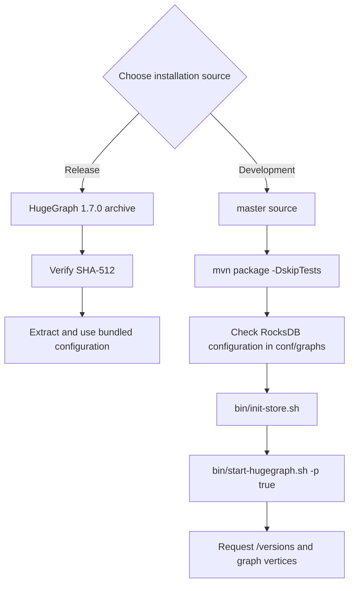

## 1 HugeGraph Server Overview

`apache/hugegraph` is the main repository for the HugeGraph graph database. Its top-level modules include `hugegraph-server`, `hugegraph-pd`, and `hugegraph-store`. This page describes the `hugegraph-server` module and the service it runs.

The `hugegraph-server` module contains `hugegraph-core`, `hugegraph-api`, `hugegraph-dist`, and storage adapters. Core implements the property graph model, transactions, and TinkerPop interfaces. API provides the HTTP service and delegates client requests to Core. Graph data is stored in RocksDB (the default standalone backend), HStore (distributed), or HBase.

> ⚠️ **Version scope**: Download examples use the ASF HugeGraph 1.7.0 release. Source builds, configuration defaults, and startup behavior follow `apache/hugegraph` master. A master build is not an ASF release artifact, even if its version number matches 1.7.0. This guide covers RocksDB, HStore, and HBase; see [1.5.x documentation](https://github.com/apache/hugegraph-doc/blob/release-1.5.0/content/en/docs/quickstart/hugegraph/hugegraph-server.md) for other legacy backends.

> Naming: `HugeGraph` means the overall project or main repository, `hugegraph-server` is its Server module, and `HugeGraphServer` is the Java service class. Server below means the running graph database service.




## 2 Dependency for Building/Running

### 2.1 Install Java 11 (JDK 11)

The `hugegraph-server` module in HugeGraph 1.7.0 is compiled with Java 11. Running and building it from source require Java 11 or later.

**Before continuing, run `java -version` to confirm your JDK version.**

> Java 8 is no longer supported starting from 1.7.0. `bin/hugegraph-server.sh` refuses to start on anything older than Java 11.

> The security check is on by default and installs `HugeSecurityManager`, which needs Java 11 to 23. JDK 24 removed the Security Manager ([JEP 486](https://openjdk.org/jeps/486)), so on Java 24 or later you must start the service with the check disabled: `bin/start-hugegraph.sh -s false`.

> Building from source also needs Maven 3.5.0 or later.

## 3 Deploy

There are four ways to deploy the Server service:

1. Use a Docker container for test or development.
1. Download the binary tarball.
1. Compile the source code.
1. Use the legacy one-click deployment tool.
{.steps}

> [!WARNING]
> **Production requires authentication and restricted network access**
>
> HugeGraph disables user authentication by default. Enable [authentication and authorization](/docs/config/config-authentication/), maintain an IP allowlist, and grant minimum permissions. Do not expose Gremlin, Cypher, or other query APIs directly to the public Internet. Retain Server `audit-*.log` and restrict read access. `auth.audit_log_rate` limits per-user output rate rather than turning audit logging on or off. See the [security guide](/docs/guides/security/).

### 3.1 Use Docker container (Convenient for Test/Dev)

<!-- 3.1 is linked by another place. if change 3.1's title, please check -->
You can refer to the [Docker deployment guide](https://github.com/apache/hugegraph/blob/master/docker/README.md).

You can use `docker run -itd --name=server -p 8080:8080 -e PASSWORD=xxx hugegraph/hugegraph:1.7.0` to quickly start a Server instance using the `RocksDB` backend.

Optional:
1. You can use `docker exec -it server bash` to enter the container for troubleshooting or other maintenance operations.
2. You can use `docker run -itd --name=server -p 8080:8080 -e PRELOAD="true" hugegraph/hugegraph:1.7.0` to preload a **built-in** sample graph at startup. You can verify it through the `RESTful API`. See [5.1.4](#514-create-an-example-graph-when-startup) for details.
3. You can use `-e PASSWORD=xxx` to enable authentication mode and set the admin password. See [Config Authentication](/docs/config/config-authentication#use-docker-to-enable-authentication-mode) for details.

If you use Docker Desktop, you can set the options as follows:
<div style="text-align: center;">
    
</div>

> **Note**: The Docker Compose files use bridge networking (`hg-net`) and work on Linux and Mac (Docker Desktop). For the 3-node distributed cluster on Mac (Docker Desktop), allocate at least **12 GB** of memory (Settings → Resources → Memory). On Linux, Docker uses host memory directly.

Use `docker compose` to manage multiple HugeGraph services from one configuration. Four Compose files are available in the [`docker/`](https://github.com/apache/hugegraph/tree/master/docker) directory:

| Topology | Compose file | Services |
|---|---|---|
| Standalone (start here) | `docker-compose.yml` | 1 RocksDB Server + 1 Hubble |
| Minimal HStore (current master) | `docker-compose-hstore.yml` | 1 PD + 1 Store + 1 Server + 1 Hubble; locally built master images required |
| HA reference (current master) | `docker-compose-3pd-3store-3server.yml` | 3 PD + 3 Store + 3 Server + 1 Hubble; locally built master images required |
| Source build override for the minimal HStore topology | `docker-compose.dev.yml` | (used together with `docker-compose-hstore.yml`) |

```bash {wrap=true}
cd hugegraph/docker
# Keep the version aligned with the latest release, for example 1.x.0
HUGEGRAPH_VERSION=1.7.0 docker compose -f docker-compose.yml up -d --wait
```

The standalone topology publishes the Server on port `8080` and Hubble on `127.0.0.1:8088`. `HUGEGRAPH_VERSION` selects the Server, PD, and Store image tags; Hubble is selected separately with `HUBBLE_IMAGE`.

The standalone `docker-compose.yml` example uses `hugegraph/hugegraph:1.7.0`; its `docker/conf/hubble/standalone.properties` is bundled in source. Compose reads the administrator password from `HUGEGRAPH_ADMIN_PASSWORD` and JWT secret from `HUGEGRAPH_AUTH_TOKEN_SECRET`, normally in `docker/.env`. A nonempty password enables authentication, automatically detected by Hubble. With `docker run`, use `-e PASSWORD=xxx`. Master HStore Compose files cannot be combined with 1.7.0 PD/Store/Server release images.

**JWT version differences**: Master-built Server maps `HUGEGRAPH_AUTH_TOKEN_SECRET` to `HG_SERVER_AUTH_TOKEN_SECRET` and writes startup configuration; preserve the secret across recreation. The [1.7.0 entrypoint](https://github.com/apache/hugegraph/blob/1.7.0/hugegraph-server/hugegraph-dist/docker/docker-entrypoint.sh) handles older variables such as `PASSWORD`, ignoring `HG_SERVER_AUTH_TOKEN_SECRET`. To keep a stable JWT secret in 1.7.0, persist [`auth.token_secret`](https://github.com/apache/hugegraph/blob/1.7.0/hugegraph-server/hugegraph-core/src/main/java/org/apache/hugegraph/config/AuthOptions.java) in that version's `conf/graphs/hugegraph.properties`. With a randomly generated default, do not assume issued JWTs survive Server restarts.

See [docker/README.md](https://github.com/apache/hugegraph/blob/master/docker/README.md) for the full setup guide.

> Note: 
>
> 1. HugeGraph Docker images are provided as a convenient way to start HugeGraph quickly, but they are not official ASF distribution artifacts. You can find more details in the [ASF Release Distribution Policy](https://infra.apache.org/release-distribution.html#dockerhub).
>
> 2. We recommend using a release tag (such as `1.7.0` or `1.x.0`) for stable deployments. Use the `latest` tag only if you want the newest features still under development.

### 3.2 Download a Released Archive

This example uses HugeGraph 1.7.0. For other versions, confirm the release and filenames in the [ASF download directory](https://downloads.apache.org/hugegraph/). A master source build is not a released binary.

```bash {filename="download-release.sh" wrap=true collapse=2}
cd /path/to/downloads
wget https://downloads.apache.org/hugegraph/1.7.0/apache-hugegraph-incubating-1.7.0.tar.gz
wget https://downloads.apache.org/hugegraph/1.7.0/apache-hugegraph-incubating-1.7.0.tar.gz.sha512
sha512sum -c apache-hugegraph-incubating-1.7.0.tar.gz.sha512
tar zxf apache-hugegraph-incubating-1.7.0.tar.gz
```

Extract only after SHA-512 verification succeeds. You can also verify the PGP signature following Apache release procedures:

```bash
wget https://downloads.apache.org/hugegraph/1.7.0/apache-hugegraph-incubating-1.7.0.tar.gz.asc
wget https://downloads.apache.org/hugegraph/KEYS
gpg --import KEYS
gpg --verify apache-hugegraph-incubating-1.7.0.tar.gz.asc apache-hugegraph-incubating-1.7.0.tar.gz
```

Trust publisher keys only after verifying them through Apache project channels. Signature verification can complement SHA-512 checks.

### 3.3 Build from master Source

These commands build the development branch, not the 1.7.0 release.

Install `wget` or `curl` before building.

Download HugeGraph source:

```bash {filename="build-from-source.sh" wrap=true collapse=2}
git clone --branch master https://github.com/apache/hugegraph.git
```

Compile and package:

```bash
cd hugegraph
# (Optional) use "-P stage" param if you build failed with the latest code(during pre-release period)
mvn package -DskipTests -ntp
```

A successful build logs:

```bash
[INFO] BUILD SUCCESS
```

The build creates an aggregate master archive under repository-root `target/` (the current source version property is 1.7.0):

```text
target/apache-hugegraph-1.7.0.tar.gz
```

The filename version comes from source `revision`; it does not make the build an ASF release artifact. The build also creates repository-root `apache-hugegraph-1.7.0/`, containing a Server directory named by that module's `final.name`, currently `apache-hugegraph-server-1.7.0`. If retaining only the archive, first run `tar zxf target/apache-hugegraph-1.7.0.tar.gz`, then enter the Server directory.

Default builds bundle `rocksdb`, `hbase`, and `hstore` modules, listed in `backends` within `backend.properties` in the `hugegraph-dist` JAR. For a RocksDB-only distribution, add `-Drocksdb-only`:

```bash
mvn package -DskipTests -ntp -Drocksdb-only
```


> [!DETAILS]- Outdated tools
> #### 3.4 One-click deployment (Outdated)
>
> HugeGraph-Tools provides a one-click deployment command that downloads, extracts, configures, and starts the Server service and HugeGraph-Hubble. These tools are included in the HugeGraph-Toolchain distribution.
>
> Of course, you should download the tarball of `HugeGraph-Toolchain` first.
>
> ```bash
> # download toolchain binary package, it includes loader + tool + hubble
> # please check the latest version (e.g. here is 1.7.0)
> wget https://downloads.apache.org/hugegraph/1.7.0/apache-hugegraph-toolchain-incubating-1.7.0.tar.gz
> tar zxf *hugegraph-*.tar.gz
>
> # enter the tool's package
> cd *hugegraph*/*tool* 
> ```
>
> > note: `${version}` is the version, The latest version can refer to [Download Page](/docs/download/download), or click the link to download directly from the Download page
>
> The general entry script for HugeGraph-Tools is `bin/hugegraph`, Users can use the `help` command to view its usage, here only the commands for one-click deployment are introduced.
>
> ```bash
> bin/hugegraph deploy -v {hugegraph-version} -p {install-path} [-u {download-path-prefix}]
> ```
>
> `{hugegraph-version}` is the Server service and HugeGraphStudio version; see `conf/version-mapping.yaml` for supported mappings. `{install-path}` is the installation directory, while `{download-path-prefix}` optionally overrides the tarball download location. For example, deploy version 0.6 with `bin/hugegraph deploy -v 0.6 -p services`.

## 4 Configuration

Server archives include `conf/rest-server.properties`, `conf/gremlin-server.yaml`, and `conf/graphs/hugegraph.properties`; source builds assemble them from `hugegraph-server/hugegraph-dist/src/assembly/static/conf/`. Edit them inside the extracted Server directory without a separate generation step. Defaults vary by release; the following defaults and startup behavior describe master.

For standalone RocksDB, confirm `backend=rocksdb` and `serializer=binary` in `conf/graphs/hugegraph.properties`. Normal Server initialization scans `conf/graphs/` and loads local graphs without requiring `graph.load_from_local_config=true`. This option defaults to `false` and controls constructor preloading and rescanning on `reload()`.

See the [configuration guide](/docs/config/config-guide/) and [option reference](/docs/config/config-option/) for details.


## 5 Startup

### 5.1 Use a startup script to startup

Startup is divided into "first startup" and "non-first startup". On the first startup, you need to initialize the backend database before starting the service.

If the service was stopped manually, or needs to be started again for any other reason, you can usually start it directly because the backend database is persistent.

When HugeGraphServer starts, it connects to the backend storage and checks its version information. If the backend has not been initialized, or if it was initialized with an incompatible version (for example, old-version data), HugeGraphServer will fail to start and report an error.

If you need to access HugeGraphServer externally, modify the `restserver.url` configuration item in `rest-server.properties` (the default is `http://127.0.0.1:8080`) and change it to the machine name or IP address.

Since the configuration (hugegraph.properties) and startup steps required by various backends are slightly different, the following will introduce the configuration and startup of each backend one by one.

> [!WARNING]
> **Configure authentication before production startup**
>
> Enable [Server authentication and authorization](/docs/config/config-authentication/) with a strong, nondefault administrator password, an IP allowlist, and minimum business-user permissions.

#### 5.1.1 Distributed Storage (HStore)

<details>
<summary>Expand/collapse distributed storage configuration and startup</summary>

> Distributed storage, introduced after HugeGraph 1.5.0, uses HugeGraph-PD and HugeGraph-Store for distributed data storage and computing.

First deploy PD and Store; see the [PD Quick Start](/docs/quickstart/hugegraph/hugegraph-pd/) and [Store Quick Start](/docs/quickstart/hugegraph/hugegraph-hstore/).

After PD and Store are running:

1. Edit Server `hugegraph.properties`:

```properties
backend=hstore
serializer=binary

# PD RPC addresses, separated by commas
pd.peers=127.0.0.1:8686,127.0.0.1:8687,127.0.0.1:8688
pd.cluster=hg
```

```properties
# Simple example with authentication
gremlin.graph=org.apache.hugegraph.auth.HugeFactoryAuthProxy

# Required HStore backend
backend=hstore
serializer=binary
store=hugegraph

# pd config
pd.peers=127.0.0.1:8686
pd.cluster=hg
```

The distribution includes `conf/graphs/hstore.properties.template`; copy it over `conf/graphs/hugegraph.properties` and adjust `pd.peers`.

This example uses `cluster=hg` in `rest-server.properties` and `pd.cluster=hg` in graph configuration, matching the master Compose cluster below. These are separate keys for the Server process and graph respectively, not one setting. Select an appropriate cluster name. Likewise, `pd.peers` in each file has its own configuration scope; this example supplies the same PD RPC addresses to both.

The backend selects the task scheduler: HStore uses distributed scheduling; others use local scheduling. `task.scheduler_type` is unnecessary and is ignored with a warning when retained for compatibility.

2. Edit Server `rest-server.properties`:

```properties
usePD=true
# Use cluster hg, matching pd.cluster in graph configuration
cluster=hg
# Server process PD addresses; replace with actual PD RPC addresses
pd.peers=127.0.0.1:8686,127.0.0.1:8687,127.0.0.1:8688

# Optional in local tests; authentication is mandatory in production
# auth.authenticator=org.apache.hugegraph.auth.StandardAuthenticator
```

These addresses support multiple Server processes on one machine; `127.0.0.1` is local only. Across hosts, use routable IPs or DNS for `restserver.url`, `gremlinserver.url`, `pd.peers`, Gremlin `host`, and `rpc.server_host`. Advertised RPC addresses and ports must be mutually reachable.

For multiple Servers, edit each node's `rest-server.properties`:

Node 1 (master):
```properties
usePD=true
restserver.url=http://127.0.0.1:8081
gremlinserver.url=http://127.0.0.1:8181
pd.peers=127.0.0.1:8686

rpc.server_host=127.0.0.1
rpc.server_port=8091

server.id=server-1
server.role=master
```

Node 2 (worker):
```properties
usePD=true
restserver.url=http://127.0.0.1:8082
gremlinserver.url=http://127.0.0.1:8182
pd.peers=127.0.0.1:8686

rpc.server_host=127.0.0.1
rpc.server_port=8092

server.id=server-2
server.role=worker
```

Also configure each node's `gremlin-server.yaml` ports:

Node 1:
```yaml
host: 127.0.0.1
port: 8181
```

Node 2:
```yaml
host: 127.0.0.1
port: 8182
```

Start Server:

```bash
bin/start-hugegraph.sh
```

Distributed startup order:
1. Start HugeGraph-PD
2. Start HugeGraph-Store
3. Start Server

PD and Store manage HStore metadata and storage, so `init-store` skips that backend. With authentication enabled, `init-store` still creates the built-in `admin` account. If storage already holds this account, set `init_store.enabled=false` in `rest-server.properties` to skip the entire step, as Docker HStore topologies do.

Verify startup:

```bash
curl http://localhost:8081/graphspaces/DEFAULT/graphs
# Expected: {"graphs":["hugegraph"]}
```

Stop in reverse order:
1. Stop Server
2. Stop HugeGraph-Store
3. Stop HugeGraph-PD

```bash
bin/stop-hugegraph.sh
```

##### Docker HStore HA Cluster (Current Master)

`docker-compose-3pd-3store-3server.yml` uses master `HG_PD_*`, `HG_STORE_*`, and `HG_SERVER_*` variables unsupported by 1.7.0 release images. Build PD, Store, and Server from the same master source, all tagged `local`:

```bash
# Run from the HugeGraph repository root
docker build -f hugegraph-pd/Dockerfile -t hugegraph/pd:local .
docker build -f hugegraph-store/Dockerfile -t hugegraph/store:local .
docker build -f hugegraph-server/Dockerfile-hstore -t hugegraph/server:local .

cd docker
```

Create the authentication environment in `docker/` and generate HStore Hubble configuration. Replace the example administrator password; because `.env` uses single quotes, the password must contain neither single quotes nor newlines. The script generates random JWT and PD secrets and writes the PD secret to two untracked `.local.properties` files mounted by HStore Compose:

> [!WARNING]
> `umask 077` protects the new `.env`, but `set-hubble-pd-password.sh` sets generated `.local.properties` permissions to `0644`, making the PD secret readable by other local users. This example assumes trusted local users. On shared hosts, set ownership and read permissions for the Hubble runtime user so Hubble can read the files while unauthorized users cannot. Keeping files untracked does not replace file permission controls.

```bash
(
  set -eu
  command -v openssl >/dev/null
  jwt_secret="$(openssl rand -hex 32)"
  pd_secret="$(openssl rand -hex 24)"
  umask 077
  test ! -e .env || {
    echo ".env already exists; edit it instead of overwriting it" >&2
    exit 1
  }
  printf "HUGEGRAPH_ADMIN_PASSWORD='%s'\nHUGEGRAPH_AUTH_TOKEN_SECRET='%s'\nHG_PD_AUTH_SECRET_KEY='%s'\n" \
    'replace-with-your-password' "${jwt_secret}" "${pd_secret}" > .env
  HG_PD_AUTH_SECRET_KEY="${pd_secret}" ./set-hubble-pd-password.sh hstore
  HG_PD_AUTH_SECRET_KEY="${pd_secret}" ./set-hubble-pd-password.sh hstore-ha
)
```

Start HA from `docker/`. `HUGEGRAPH_VERSION=local` selects the locally built PD, Store, and Server images; Compose `pull_policy: missing` uses existing local tags first. `HUBBLE_IMAGE` still selects Hubble independently:

```bash
set -a
. ./.env
set +a
HUGEGRAPH_VERSION=local docker compose \
  -f docker-compose-3pd-3store-3server.yml \
  up -d --wait pd0 pd1 pd2 store0 store1 store2 server0 server1 server2 hubble
```

Generate `HG_PD_AUTH_SECRET_KEY` once for new data directories and reuse it on restart or when retaining data. Do not commit `.env` or generated `conf/hubble/*.local.properties`. Services communicate through container hostnames on the `hg-net` bridge. Server replicas need the shared JWT secret as well as the administrator password; set `HUGEGRAPH_AUTH_TOKEN_SECRET`. See the [Docker cluster guide](/docs/guides/hugegraph-docker-cluster/) and [docker/README.md](https://github.com/apache/hugegraph/blob/master/docker/README.md) for all variables.

Verify the cluster:
```bash
curl -fsS http://localhost:8080/versions
curl -fsS -u "hg:${HG_PD_AUTH_SECRET_KEY:?Load .env first}" \
  http://localhost:8620/v1/stores
```

Master PD `/v1/stores` requires Basic authentication; this uses the generated, loaded `HG_PD_AUTH_SECRET_KEY` as the `hg` password.

Inspect runtime logs with `docker logs <container-name>`, such as `docker logs hg-pd0`.

See [docker/README.md](https://github.com/apache/hugegraph/blob/master/docker/README.md) for variables, ports, and troubleshooting.
</details>


#### 5.1.2 RocksDB / ToplingDB

The minimal standalone flow below uses a master build and preloads sample data to verify graph reads and writes.

<details>
<summary>Expand/collapse RocksDB configuration and startup</summary>


> RocksDB is embedded and needs no separate deployment. GCC ≥ 4.3.0 (GLIBCXX_3.4.10) is required; upgrade first if needed.

Master `conf/graphs/hugegraph.properties` already sets `backend=rocksdb` and `serializer=binary`. Keep the defaults if using default data directories; otherwise check your backend and paths before initialization.

Initialize storage on first startup or after adding graph configuration under `conf/graphs/`:

```bash
cd apache-hugegraph-1.7.0/apache-hugegraph-server-1.7.0
bin/init-store.sh
```

Start Server and preload the built-in sample graph:

```bash
bin/start-hugegraph.sh -p true
```

The startup script polls `/graphs` at configured `restserver.url` and exits nonzero on timeout or process failure. Check service version, then read sample vertices:

```bash
curl -fsS http://127.0.0.1:8080/versions
curl --compressed -fsS \
  http://127.0.0.1:8080/graphspaces/DEFAULT/graphs/hugegraph/graph/vertices
```

The first response should contain `versions`; the second should contain `vertices` with sample names such as `marko` and `lop`. A process check or HTTP status alone does not prove backend and business request health.

**ToplingDB (Beta)**: A high-performance RocksDB alternative; see the [ToplingDB Quick Start]().

</details>


#### 5.1.3 HBase
> [!DETAILS]- Click to expand/collapse HBase configuration and startup methods
> > users need to install HBase by themselves, requiring version 2.0 or above,[download link](https://hbase.apache.org/downloads.html)
>
> Update hugegraph.properties
>
> ```properties
> backend=hbase
> serializer=hbase
>
> # hbase backend config
> hbase.hosts=localhost
> hbase.port=2181
> # Note: recommend to modify the HBase partition number by the actual/env data amount & RS amount before init store
> # it may influence the loading speed a lot
> #hbase.enable_partition=true
> #hbase.vertex_partitions=10
> #hbase.edge_partitions=30
> ```
>
> Initialize the database (required on the first startup, or a new configuration was manually added under 'conf/graphs/')
>
> ```bash
> cd *hugegraph-${version}
> bin/init-store.sh
> ```
>
> Start server
>
> ```bash
> bin/start-hugegraph.sh
> Starting HugeGraphServer in daemon mode...
> Connecting to HugeGraphServer (http://127.0.0.1:8080/graphs)....OK
> Started [pid 21614]
> ```
>
#### 5.1.4 Create an example graph when startup
Pass the `-p true` argument when starting the script to enable `preload`, which creates a sample graph.

```
bin/start-hugegraph.sh -p true
Starting HugeGraphServer in daemon mode...
Connecting to HugeGraphServer (http://127.0.0.1:8080/graphs)......OK
```

And use the RESTful API to request `HugeGraphServer` and get the following result:

```javascript
> curl "http://localhost:8080/graphspaces/DEFAULT/graphs/hugegraph/graph/vertices" | gunzip

{"vertices":[{"id":"2:lop","label":"software","type":"vertex","properties":{"name":"lop","lang":"java","price":328}},{"id":"1:josh","label":"person","type":"vertex","properties":{"name":"josh","age":32,"city":"Beijing"}},{"id":"1:marko","label":"person","type":"vertex","properties":{"name":"marko","age":29,"city":"Beijing"}},{"id":"1:peter","label":"person","type":"vertex","properties":{"name":"peter","age":35,"city":"Shanghai"}},{"id":"1:vadas","label":"person","type":"vertex","properties":{"name":"vadas","age":27,"city":"Hongkong"}},{"id":"2:ripple","label":"software","type":"vertex","properties":{"name":"ripple","lang":"java","price":199}}]}
```

This indicates the successful creation of the sample graph.

#### 5.1.5 Startup script options

`bin/start-hugegraph.sh` accepts the following options. Every one of them takes a value, so write `-d false`, not a bare `-d`.

| Option | Values | Default | Purpose |
|---|---|---|---|
| `-d` | `true`, `false` | `true` | Daemon mode. With `-d false` the script stays in the foreground and forwards `SIGTERM`/`SIGINT` to the server. |
| `-g` | `zgc` or `ZGC` | omit for G1GC | Garbage collector to use. Only ZGC is accepted, any other value aborts the startup. ZGC needs Java 11 or later. |
| `-m` | `true`, `false` | `false` | Install the cron-based monitor task (`bin/start-monitor.sh`). For VM and bare-metal deployments only. |
| `-p` | `true`, `false` | `false` | Preload the sample graph, as in 5.1.4. |
| `-s` | `true`, `false` | `true` | Run with the security check (`HugeSecurityManager`) enabled. It requires Java 11 to 23 and a readable `conf/java-security.properties`. |
| `-j` | JVM options | empty | Extra JVM options appended to the server command line. |
| `-t` | seconds | `30` | How long to wait for the service to answer before reporting a failed startup. |
| `-y` | `true`, `false` | `false` | Enable the OpenTelemetry agent for traces. |

`bin/stop-hugegraph.sh` accepts `-m true|false` (default `true`), which controls whether the cron monitor task is removed along with the service.

### 5.2 Use Docker to startup

In [3.1 Use Docker container](#31-use-docker-container-convenient-for-testdev), we introduced how to deploy `hugegraph-server` with Docker. You can also switch storage backends or preload a sample graph by setting the corresponding parameters.


#### 5.2.1 Create an example graph when starting a server
Set the environment variable `PRELOAD=true` when starting Docker so that sample data is loaded during startup.

1. Use `docker run`

    Use `docker run -itd --name=server -p 8080:8080 -e PRELOAD=true hugegraph/hugegraph:1.7.0`

2. Use `docker-compose`

    Create a `docker-compose.yml` file like the following and set `PRELOAD=true` in the environment. [`example.groovy`](https://github.com/apache/hugegraph/blob/master/hugegraph-server/hugegraph-dist/src/assembly/static/scripts/example.groovy) is a predefined script used to preload sample data. If needed, you can mount a new `example.groovy` script to change the preload data.

    ```yaml
    version: '3'
    services:
      server:
        image: hugegraph/hugegraph:1.7.0
        container_name: server
        environment:
          - PRELOAD=true
          - PASSWORD=xxx
        volumes:
          - /path/to/yourscript:/hugegraph-server/scripts/example.groovy
        ports:
          - 8080:8080
    ```

    Use `docker compose up -d` to start the container.

And use the RESTful API to request `HugeGraphServer` and get the following result:

```javascript
> curl "http://localhost:8080/graphspaces/DEFAULT/graphs/hugegraph/graph/vertices" | gunzip

{"vertices":[{"id":"2:lop","label":"software","type":"vertex","properties":{"name":"lop","lang":"java","price":328}},{"id":"1:josh","label":"person","type":"vertex","properties":{"name":"josh","age":32,"city":"Beijing"}},{"id":"1:marko","label":"person","type":"vertex","properties":{"name":"marko","age":29,"city":"Beijing"}},{"id":"1:peter","label":"person","type":"vertex","properties":{"name":"peter","age":35,"city":"Shanghai"}},{"id":"1:vadas","label":"person","type":"vertex","properties":{"name":"vadas","age":27,"city":"Hongkong"}},{"id":"2:ripple","label":"software","type":"vertex","properties":{"name":"ripple","lang":"java","price":199}}]}
```

This indicates that the sample graph was created successfully.


## 6. Access server

### 6.1 Service startup status check

Use `jps` to see a service process

```bash
jps
6475 HugeGraphServer
```

`curl` request `RESTfulAPI`

```bash
curl -fsS http://127.0.0.1:8080/versions
```

HTTP 2xx with a JSON `versions` field confirms REST responsiveness. `HugeGraphServer` in `jps` confirms only process existence; verify backend health by preloading the sample graph and requesting vertices as above.

### 6.2 Request Server

The RESTful API of HugeGraphServer includes various types of resources, typically including graph, schema, gremlin, traverser and task.

- `graph` contains `vertices`、`edges`
- `schema`  contains `vertexlabels`、 `propertykeys`、 `edgelabels`、`indexlabels`
- `gremlin` contains various `Gremlin` statements, such as `g.v()`, which can be executed synchronously or asynchronously
- `traverser` contains various advanced queries including shortest paths, intersections, N-step reachable neighbors, etc.
- `task` contains query and delete with asynchronous tasks

#### 6.2.1 Get vertices and its related properties in `hugegraph`

```bash
curl http://localhost:8080/graphspaces/DEFAULT/graphs/hugegraph/graph/vertices
```

_explanation_

1. Server can compress vertex, edge, and other list responses. Use `curl --compressed` for automatic decompression:

    ```
    curl --compressed -fsS "http://localhost:8080/graphspaces/DEFAULT/graphs/hugegraph/graph/vertices"
    ```

2. The default listener is `127.0.0.1`, inaccessible directly from other machines.

    ```
    vim conf/rest-server.properties
    
    restserver.url=http://0.0.0.0:8080
    ```

> [!WARNING]
> **Changing the Server listener**
>
> Setting `0.0.0.0` listens on every interface. In production, enable authentication and authorization, an IP allowlist, and minimum permissions; retain and protect audit logs. Do not expose Gremlin or Cypher directly to the public Internet.

response body:

```javasript
{
    "vertices": [
        {
            "id": "2lop",
            "label": "software",
            "type": "vertex",
            "properties": {
                "price": [
                    {
                        "id": "price",
                        "value": 328
                    }
                ],
                "name": [
                    {
                        "id": "name",
                        "value": "lop"
                    }
                ],
                "lang": [
                    {
                        "id": "lang",
                        "value": "java"
                    }
                ]
            }
        },
        {
            "id": "1josh",
            "label": "person",
            "type": "vertex",
            "properties": {
                "name": [
                    {
                        "id": "name",
                        "value": "josh"
                    }
                ],
                "age": [
                    {
                        "id": "age",
                        "value": 32
                    }
                ]
            }
        },
        ...
    ]
}
```

<p id="swaggerui-example"></p>

For the detailed API, please refer to [RESTful-API](/docs/clients/restful-api)

You can also visit `localhost:8080/swagger-ui/index.html` to check the API.

<div style="text-align: center;">
  
</div>

When using Swagger UI to debug the API provided by HugeGraph, if HugeGraph Server turns on authentication mode, you can enter authentication information on the Swagger page.

<div style="text-align: center;">
  
</div>

Currently, HugeGraph supports setting authentication information in two forms: Basic and Bearer.

<div style="text-align: center;">
  
</div>

## 7 Stop Server

```bash
cd apache-hugegraph-1.7.0/apache-hugegraph-server-1.7.0
bin/stop-hugegraph.sh
```

## 8 Debug Server with IntelliJ IDEA

Please refer to [Setup Server in IDEA](/docs/contribution-guidelines/hugegraph-server-idea-setup)
